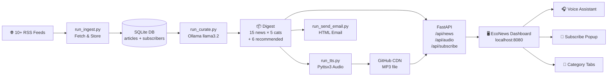

<div align="center">

<!-- Animated Header Banner -->


<!-- Animated Typing -->
<a href="https://github.com/mayank-goyal09/news-curator">
  
</a>

<br/>

<!-- Badges -->


<br/>

> **EcoNews** fetches news from 10+ RSS feeds every day, curates the best 15 stories across 5 categories using a local AI (Ollama), converts them to audio, and emails the digest to subscribers — all automatically.

### 🌐 [**Experience the Live Demo Here**](https://mayank-goyal09.github.io/news-curator/frontend/index.html)

</div>

---

## ✨ Features

<table>
<tr>
<td width="50%">

### 🤖 AI Curation
- Powered by **Ollama (llama3.2)** running 100% locally
- Picks the **top 3 stories per category** from 10+ RSS feeds
- Writes a `why_pick` explanation for each article
- Auto-generates tags and an overall daily summary

</td>
<td width="50%">

### 📰 5 News Categories
- 🎭 **Satire** — The Onion, The Babylon Bee
- 🤖 **AI & Technology** — TechCrunch, Ars Technica
- 🌍 **Worldwide News** — BBC, Reuters
- 💚 **Warming & Emotions** — Positive News, Upworthy
- 📈 **Market News** — MarketWatch, CNBC

</td>
</tr>
<tr>
<td width="50%">

### 🎧 Voice Digest
- Text-to-Speech via `pyttsx3` (offline)
- Reads all 15 curated articles by category
- MP3 uploaded to **GitHub** as CDN
- One-click **Voice Assistant** button on dashboard

</td>
<td width="50%">

### 📧 Email Newsletter
- Beautiful **HTML emails** with category sections
- Users subscribe via the dashboard popup
- Daily digest sent to **all subscribers** automatically
- Powered by Gmail App Passwords (SMTP)

</td>
</tr>
</table>

---

## 🖥️ Dashboard Preview

<div align="center">

```
╔══════════════════════════════════════════════════════════╗
║  🌿 EcoNews   About Me  Get News on Email  Voice Asst.  ║
╠══════════════════════════════════════════════════════════╣
║                                    ┌──────────────────┐  ║
║  BEST OF THE WEEK                  │  Recommended     │  ║
║                                    │                  │  ║
║  "ChatGPT reaches 900M             │ 1. AI story...   │  ║
║   weekly active users"             │ 2. Market...     │  ║
║                                    │ 3. World...      │  ║
║  Read article →                    │ 4. Tech...       │  ║
║                                    │ 5. Satire...     │  ║
║  ─────────────────────────────     └──────────────────┘  ║
║  Satire  AI Tech  World  Warm  Market                    ║
║  ┌───────┐ ┌───────┐ ┌───────┐                          ║
║  │Card 1 │ │Card 2 │ │Card 3 │  ← 3 per category        ║
║  └───────┘ └───────┘ └───────┘                          ║
╚══════════════════════════════════════════════════════════╝
```

*☕ After 15 seconds: "Grab your coffee! Sit back & listen to today's news."*

</div>

---

## 🏗️ Architecture



---

## 📁 Project Structure

```
news-curator/
│
├── 🐍 app/
│   ├── core/
│   │   ├── config.py          # Settings & env vars
│   │   └── sources.py         # 10+ RSS feeds × 5 categories
│   ├── db/
│   │   └── sqlite.py          # DB init (articles, digests, subscribers)
│   └── services/
│       ├── curator.py         # Ollama curation engine
│       ├── digest_store.py    # Save/load digests
│       ├── email_renderer.py  # HTML email builder
│       ├── email_sender.py    # SMTP + subscriber broadcast
│       ├── fetcher.py         # RSS parser
│       ├── github_uploader.py # MP3 → GitHub CDN
│       ├── ollama_client.py   # LLM interface
│       └── tts.py             # Text-to-Speech
│
├── 🌐 frontend/
│   ├── index.html             # Dashboard UI
│   ├── style.css              # Design system + animations
│   └── script.js              # API calls, audio, popups
│
├── 🚀 run_ingest.py           # Step 1: Fetch RSS → DB
├── 🧠 run_curate.py           # Step 2: AI curation
├── 🎙️ run_tts.py              # Step 3: Generate audio
├── 📧 run_send_email.py       # Step 4: Send digest emails
├── ⚡ run_daily.py            # All 4 steps in one command
├── 🖥️ app/main.py             # FastAPI server
└── 📋 requirements.txt
```

---

## 🚀 Quick Start

### Prerequisites

```bash
# 1. Install Ollama
# Download from https://ollama.ai and run:
ollama pull llama3.2

# 2. Clone the repo
git clone https://github.com/mayank-goyal09/news-curator.git
cd news-curator

# 3. Install dependencies
pip install -r requirements.txt
```

### Configure `.env`

```env
# Email (Gmail)
NEWS_EMAIL_SENDER=your@gmail.com
NEWS_EMAIL_APP_PASSWORD=xxxx-xxxx-xxxx-xxxx
NEWS_EMAIL_TO=recipient@gmail.com

# Ollama
OLLAMA_HOST=http://localhost:11434
OLLAMA_MODEL=llama3.2

# GitHub (for audio CDN)
GITHUB_TOKEN=ghp_xxxxxxxxxxxx
GITHUB_REPO=your-username/news-curator
GITHUB_PAGES_BASE_URL=https://raw.githubusercontent.com/your-username/news-curator/main
```

### Run

```bash
# Start the AI pipeline (fetch → curate → audio → email)
python run_daily.py

# Start the web dashboard
python -m uvicorn app.main:app --host 0.0.0.0 --port 8080

# Open in browser
# → http://localhost:8080/
```

---

## ⏰ Automated Daily Schedule (Windows)

Set up **Task Scheduler** to run `run_daily.py` automatically:

| Time | Task | What Happens |
|------|------|-------------|
| 🌅 **7:00 AM** | `python run_daily.py` | Morning digest curated + emailed |
| 🌙 **8:00 PM** | `python run_daily.py` | Evening digest curated + emailed |

> **Subscribers** receive a beautiful HTML email with all 15 news articles organized by category, plus an audio player link.

---

## 🔌 API Reference

| Endpoint | Method | Description |
|----------|--------|-------------|
| `/` | GET | Serves the EcoNews dashboard |
| `/api/news` | GET | All 15 curated news (by category) |
| `/api/news?category=ai` | GET | Filter by category |
| `/api/news/featured` | GET | Featured "Best of Week" article |
| `/api/audio` | GET | Audio MP3 URL |
| `/api/subscribe` | POST | `{"email": "..."}` — subscribe |
| `/api/categories` | GET | Category metadata |

---

## 🛠️ Tech Stack

<div align="center">

| Layer | Technology |
|-------|-----------|
| **Backend** | FastAPI + Uvicorn |
| **AI Model** | Ollama (llama3.2) — 100% local, no API keys |
| **Database** | SQLite |
| **RSS Parsing** | feedparser |
| **Text-to-Speech** | pyttsx3 (offline) |
| **Audio CDN** | GitHub Raw |
| **Email** | smtplib + Gmail SMTP |
| **Frontend** | Vanilla HTML + CSS + JS |

</div>

---

## 🗺️ Roadmap

- [x] RSS ingestion across 5 categories
- [x] Local AI curation (Ollama)
- [x] Text-to-Speech audio digest
- [x] HTML email newsletter
- [x] Live dashboard with category switching
- [x] Email subscription system
- [x] Voice Assistant button
- [x] ☕ "Grab your coffee" toast nudge
- [ ] Cloud deployment (Railway / Render)
- [ ] Mobile-responsive layout improvements
- [ ] User login & personalised feeds
- [ ] Telegram / WhatsApp notifications

---

## 👨‍💻 Author

<div align="center">

<a href="https://mayank-goyal09.github.io/">
  
</a>

<br/><br/>

[](https://mayank-goyal09.github.io/)
[](https://github.com/mayank-goyal09)

</div>

---

<!-- Footer Wave -->

